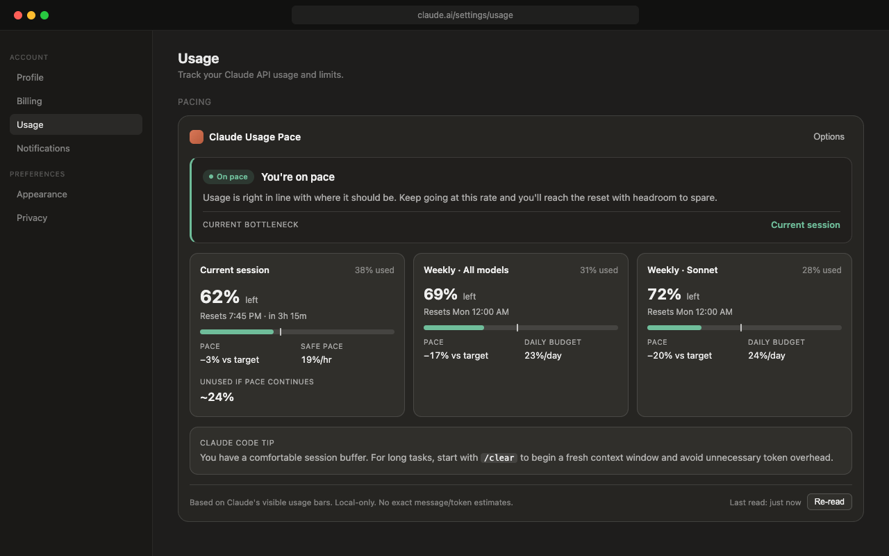
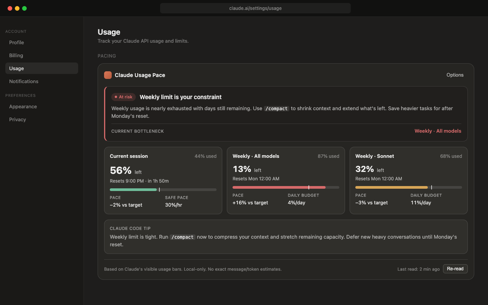
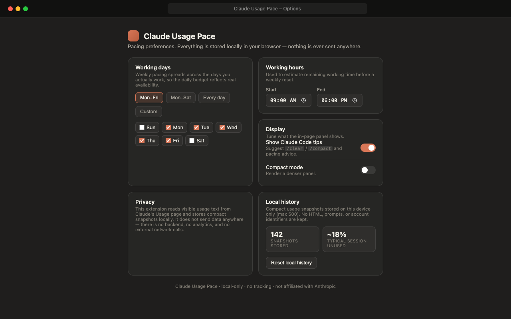

# Claude Usage Pace

**Claude shows how much you've used. Claude Usage Pace shows whether that usage is healthy for right now.**

A small, **local-only** dashboard injected directly into Claude's usage settings page, right below Claude's native usage section. It turns Claude's raw usage bars into pacing guidance: how much session capacity is left, whether you're ahead of or behind pace, and whether now is a good time to start a heavy Claude Code task.

<p align="center">
  <a href="https://chromewebstore.google.com/detail/lgcnelbecgncenjaoomkmchppkkigjod">
    
  </a>
  
  
  
</p>

## Install

**[➜ Add to Chrome from the Chrome Web Store](https://chromewebstore.google.com/detail/lgcnelbecgncenjaoomkmchppkkigjod)**

Then visit `https://claude.ai/settings/usage` (or `https://claude.ai/code#settings/usage`). The **Claude Usage Pace** panel appears beneath Claude's native usage section.

Works in Chrome and any Chromium-based browser (Edge, Brave, Arc, etc.).

## What it answers

Questions Claude's raw bars don't:

- Is this a good time to start a heavy Claude Code task?
- Am I under or over pace for the current five-hour session?
- How much session capacity is left?
- Is my weekly quota becoming the bottleneck?
- Am I likely to leave usage unused?

## Screenshots

| Dashboard | At-risk pacing | Options |
| --- | --- | --- |
|  |  |  |

## Features

- **Top recommendation** with careful, non-overconfident copy and a **current bottleneck** line (None / Current session / Weekly all-model / Weekly model-specific).
- **Current session pacing** — large "% left", live countdown, used-vs-expected mini bar with a linear pace marker, safe pace per hour, and "Unused if pace continues".
- **Weekly all-model pacing**, plus **Sonnet** pacing when visible.
- **Bottleneck detection** — surfaces the limit most likely to constrain heavy work.
- **State-based task guidance** — what's a good use of Claude right now, with `/clear` / `/compact` hints (toggleable).
- **Tooltips** explaining every calculated metric — keyboard accessible.
- **Graceful error state** — a small, non-alarming note instead of a broken dashboard when usage can't be read; never shows `NaN` / `Infinity`.
- **Local-only** — no tracking, no backend, no network calls.

## Privacy

Claude Usage Pace reads only visible usage percentages and reset labels from Claude's usage settings page. It does **not** read your Claude prompts, responses, or conversation content. It never stores page HTML or account identifiers.

There is **no backend, no analytics, and no external network calls**. Preferences and compact usage snapshots are stored locally in your browser via `chrome.storage.local`.

Permissions requested:

- `storage` — to save your preferences and local history on this device.
- host access to `https://claude.ai/*` — to read the usage page and inject the panel.

See [`store-assets/privacy-practices.md`](store-assets/privacy-practices.md) for the full breakdown.

## Limitations & assumptions

Claude usage is variable. This extension does not estimate exact messages, tokens, or guaranteed remaining tasks — all guidance is **percentage-based**.

- **The usage page is the source of truth.** Usage happens across Claude Code, Desktop, and the web; this reads the page Claude shows, which already aggregates those.
- **Reset text drives the clock.** The weekly reset is taken from Claude's visible "Resets …" label (in your browser's local time zone). The session is treated as a rolling **5-hour** window.
- **Working-day pacing.** The weekly "daily budget" is spread across your configured working days (default Mon–Fri).
- **Resilient, not bullet-proof parsing.** If Claude changes its layout drastically, the panel shows whatever it can, or a small non-blocking note. Enable **Show parser debug details** in Options to see exactly what was read.
- Chrome / Chromium, Manifest V3.

## Build from source

```bash
npm install
npm run build      # type-check + production build → ./dist
```

Then load the unpacked extension:

1. Open `chrome://extensions`.
2. Turn on **Developer mode** (top-right).
3. Click **Load unpacked** and select the **`dist/`** folder.

Other scripts:

```bash
npm run dev        # build once, then rebuild content.js on change
npm run typecheck  # tsc --noEmit
npm run lint       # eslint
npm run test       # vitest unit tests
```

## Not affiliated with Anthropic

Claude Usage Pace is an independent tool and is **not affiliated with, endorsed by, or sponsored by Anthropic**. "Claude" is a trademark of Anthropic.

## License

MIT.
