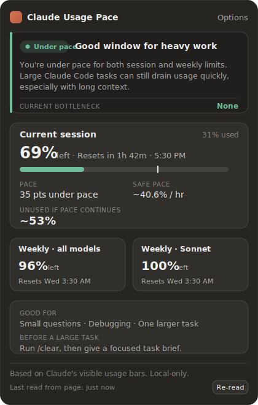

# Claude Usage Pace

Inline pacing helper for Claude usage.

Claude shows how much you used. This extension shows whether that usage is
**healthy for right now** — injected directly into Claude's usage settings page
(`https://claude.ai/code#settings/usage` and `https://claude.ai/settings/usage`).

It answers questions Claude's raw bars don't:

- Should I start a heavy Claude Code task now?
- Am I underusing the current 5-hour session?
- Am I burning usage too fast?
- How much weekly capacity is left, and is the session or the week the bottleneck?
- Am I likely to end the session/week with unused allowance?



## Features

- Current five-hour **session pacing** (used vs. expected-by-now, live countdown)
- Weekly **all-model pacing**
- **Sonnet-only** pacing when visible (inherits the weekly reset if it has none)
- **Projected unused** capacity at reset, from your current burn rate
- **Safe usage rate** until reset (per hour for the session, per working day for the week)
- **Claude Code tips** (e.g. `/clear` / `/compact` when burn is high)
- **Local-only** storage of compact snapshots — no tracking, no backend, no network calls

## Install (load unpacked)

```bash
npm install
npm run build      # outputs ./dist
```

Then in Chrome (or any Chromium browser):

1. Open `chrome://extensions`.
2. Turn on **Developer mode** (top-right).
3. Click **Load unpacked** and select the **`dist/`** folder.
4. Visit `https://claude.ai/settings/usage` (or `https://claude.ai/code#settings/usage`).
   The **Claude Usage Pace** panel appears beneath the native usage section.

To change preferences: right-click the extension → **Options**, or open the panel's
**⚙ Options** button, or use **Details → Extension options** on `chrome://extensions`.

## Development

```bash
npm install
npm run dev        # full build once, then rebuilds content.js on change
npm run build      # type-check + production build of dist/
npm run typecheck  # tsc --noEmit
npm run test       # vitest unit tests
npm run icons      # regenerate public/icons/*.png
```

After `npm run dev`, reload the extension from `chrome://extensions` (and reload the
Claude tab) to pick up changes.

### Architecture

```
src/
  content/       page detection, DOM parsing, injection + lifecycle
    index.tsx          orchestrator: detect → parse → compute → inject, MutationObserver + SPA hooks
    injectPanel.ts     single shadow-DOM React root mounted after the native section
    parseClaudeUsage.ts resilient, text-first parser (no reliance on class names)
  core/          pure logic (unit-tested)
    timeWindows.ts     session/weekly windows + reset-text parsers
    workingDays.ts     working-day / working-hour math
    paceEngine.ts      status, projections, safe rates
    statusRules.ts     headline recommendation + Claude Code tips
    formatters.ts      display helpers
  storage/       chrome.storage.local wrappers
    preferences.ts     user preferences
    localHistory.ts    debounced, capped, de-duplicated snapshot history
  ui/            React components (RecommendationCard, LimitCard, MetricGrid, MiniBar, panel)
  options/       options page
  types/         shared types
  styles/        scoped panel/options CSS
```

The build is two passes (see `vite.config.ts` and `vite.content.config.ts`): the
options page is a normal Vite HTML build, while the content script is built in
library/IIFE mode so it is a single self-contained `content.js` (MV3 content
scripts cannot use runtime ES module imports). The panel renders inside a
**shadow root**, so its styles are fully isolated from claude.ai and vice-versa.

## Privacy

This extension runs entirely in your browser. It does **not** send usage data
anywhere. It only reads the **visible usage text** from Claude's settings page
and stores compact snapshots (percentages, reset labels, timestamps) locally via
`chrome.storage.local`.

It never stores page HTML, your prompts, or any account identifiers, and it makes
**no external network calls** — there is no backend, no analytics, no account.

Permissions requested:

- `storage` — to save your preferences and local history on this device.
- host access to `https://claude.ai/*` — to read the usage page and inject the panel.

## Limitations & assumptions

- **Usage is variable.** The extension never estimates exact "messages left". All
  guidance is **percentage-based** — actual capacity depends on conversation
  length, files, model, tools and task complexity.
- **The usage page is the source of truth.** Usage happens across Claude Code,
  Desktop and the web; this reads the page Claude shows, which already aggregates
  those.
- **Reset text drives the clock.** The weekly reset is taken from Claude's visible
  "Resets <Day> <time>" label (interpreted in your browser's local time zone), not
  assumed from first usage. The session is treated as a rolling **5-hour** window
  derived from "Resets in X hr Y min".
- **Working-day pacing.** Weekly "daily budget" is spread across your configured
  working days (default Mon–Fri), so it reflects realistic availability.
- **Resilient, not bullet-proof parsing.** If Claude changes its layout
  drastically the parser may find partial or no data; in that case the panel shows
  whatever it can, or a small "Usage data not found" note on the usage page only.
- Chrome / Chromium, Manifest V3.

## License

MIT — see source headers. Personal/educational tool; not affiliated with Anthropic.
